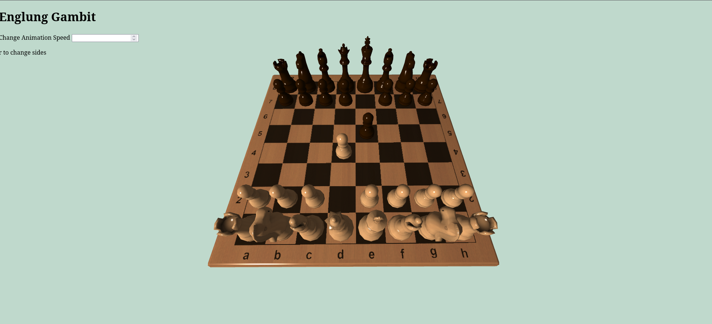
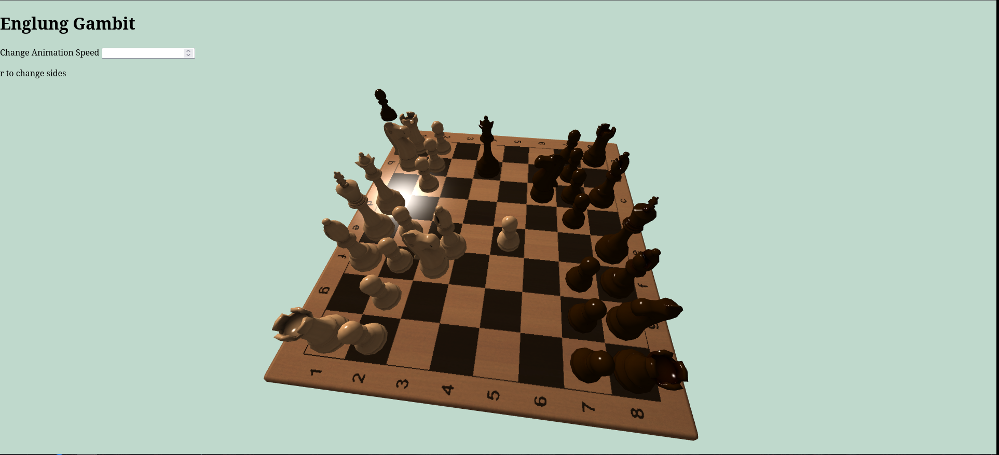
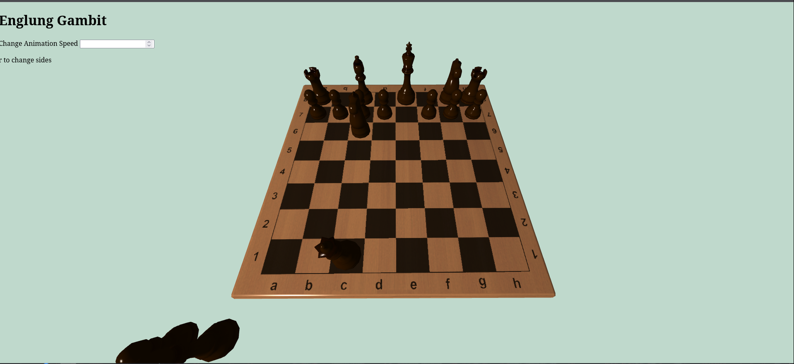

# Chess Animation Loop

A basic chess animation project built with OpenGL that replays a preset chess game through a continuous animation loop. The program focuses on smooth movement, camera presentation, and visually engaging piece animations rather than competitive gameplay or player interaction.

Instead of static piece movement, each move has been individually scripted to create a more dynamic and cinematic presentation. The result is a looping scene where a full chess match unfolds automatically on screen.

Features
Preset Chess Match Playback
A complete pre-programmed game is played from start to finish.
Custom Piece Animations
Each move is manually animated for style and visual interest.
Board Rotation Effects
The board rotates during gameplay to create a more dynamic camera perspective.
Looping Presentation
Once the game finishes, the sequence can restart as an ongoing animation.
Rendered with OpenGL
Uses OpenGL for real-time rendering and scene transformations.

### Set Board

### Rotating Board

### Finished Game

